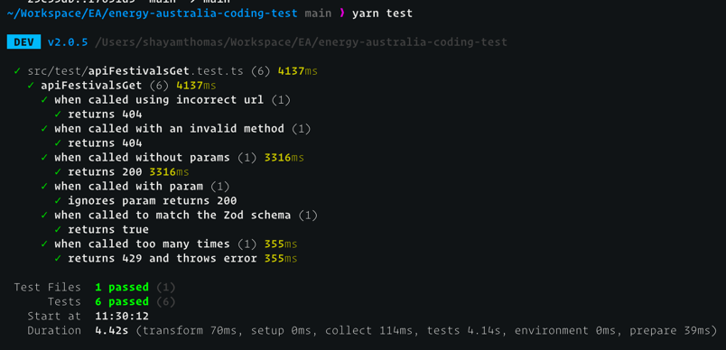

# Energy Australia Coding Assessment for Quality Engineers
This repository demonstrates a basic setup for testing a single functionality using [Vitest](https://vitest.dev/).

## Project Setup
### 1. Clone the repository
```bash
gh repo clone thomas1204/energy-australia-coding-test
```

### 2. Install dependencies using yarn
```bash
yarn install
```

## Run the test
```bash
yarn test
```

## Test Results
The test results will be displayed in the terminal.



